# Week 2 EDA Summary Report

## Executive Summary

- Cleaned bookings analyzed: 86,638
- Cancellation rate: 27.69%
- Average ADR: 107.04
- Average lead time: 80.0 days
- Largest market segment: Online TA
- Highest booking-value season: Summer

This EDA establishes the analytical foundation for customer retention and dynamic pricing. Cancellation risk is visibly associated with lead time, market segment, deposit type, hotel type, and value bands. ADR and demand also vary across months, seasons, countries, and stay patterns, supporting a future dynamic pricing engine.

## Visualization Insights

### Booking distribution

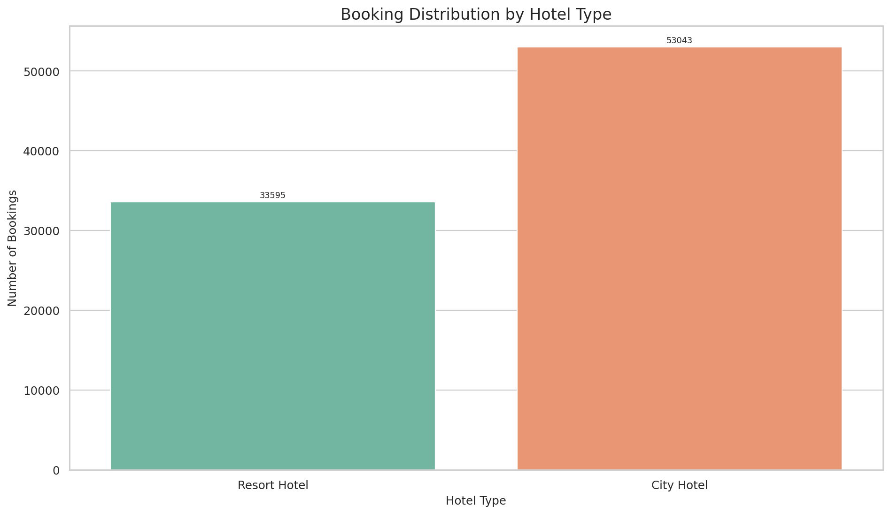

- Business insight: City Hotel contributes the largest share of bookings.
- Interpretation: Demand is not evenly distributed across hotel types, so pricing and retention strategy should not be averaged across the portfolio.
- Recommendation: Track RevPAR, cancellation rate, and ADR separately for City Hotel and Resort Hotel before setting rate fences.

### Cancellation analysis

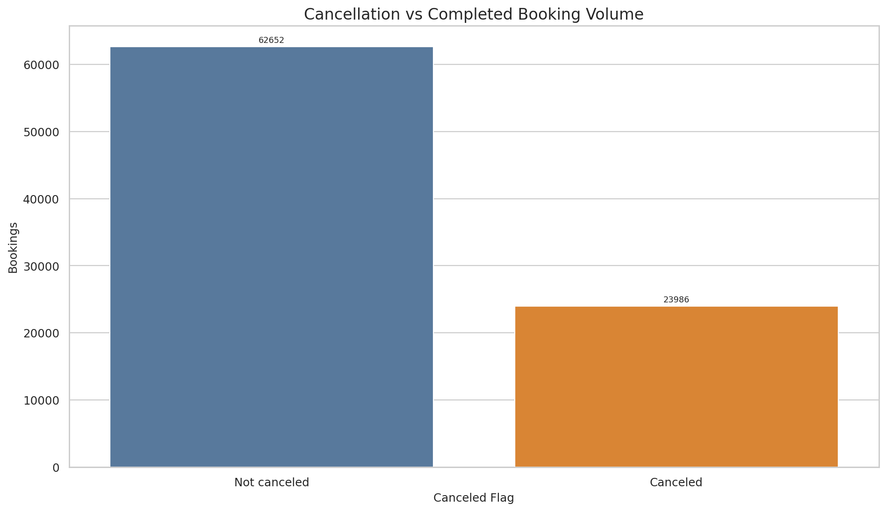

- Business insight: The cleaned dataset cancellation rate is 27.7%.
- Interpretation: Cancellation behavior is large enough to materially affect demand forecasting, staffing, and room inventory protection.
- Recommendation: Create pre-arrival retention triggers for high-risk bookings and include cancellation probability in demand forecasts.

### ADR analysis

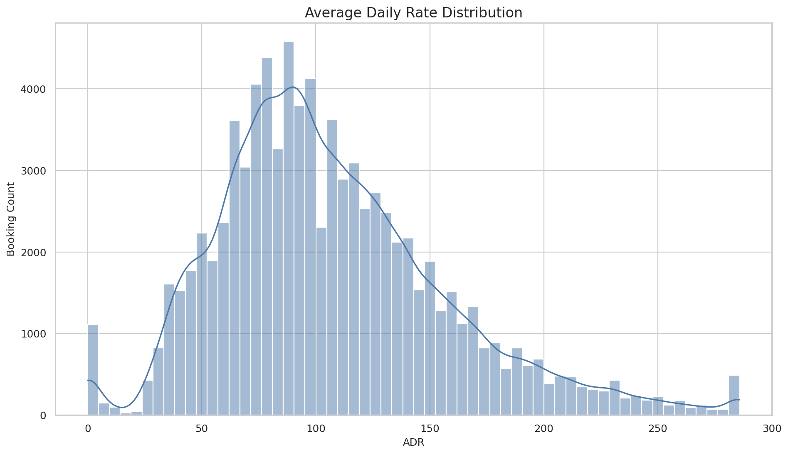

- Business insight: ADR is right-skewed with a median of 99.00 and mean of 107.04.
- Interpretation: Premium-priced bookings exist, but central tendency is lower than the upper tail, so mean-only pricing views can exaggerate normal demand.
- Recommendation: Use median ADR and percentile bands in pricing dashboards alongside average ADR.

### Hotel type

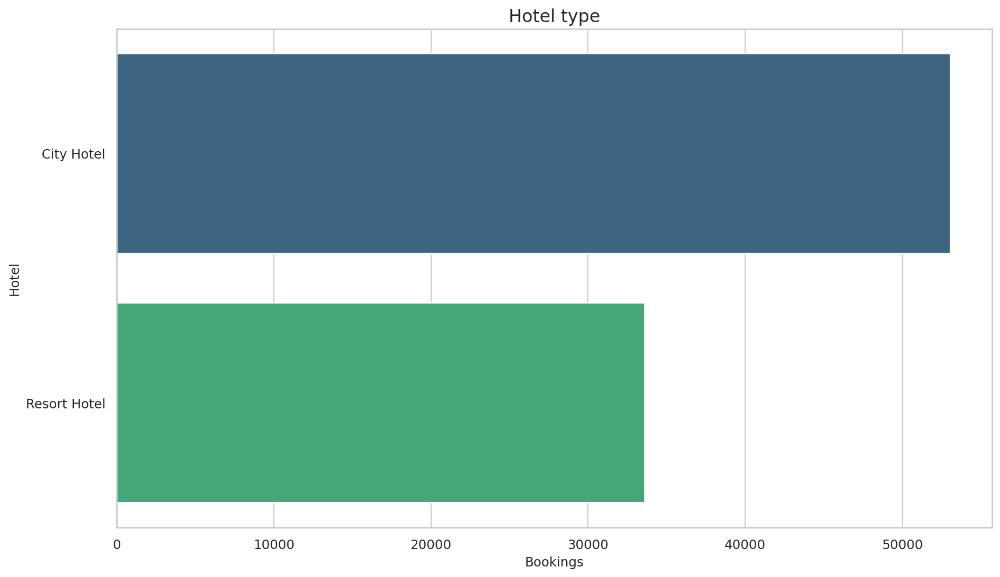

- Business insight: `City Hotel` is the largest category for hotel.
- Interpretation: Concentration in one or two categories can hide underperforming smaller channels or segments.
- Recommendation: Benchmark ADR and cancellation rate within `hotel` categories instead of relying only on total booking volume.

### Customer type

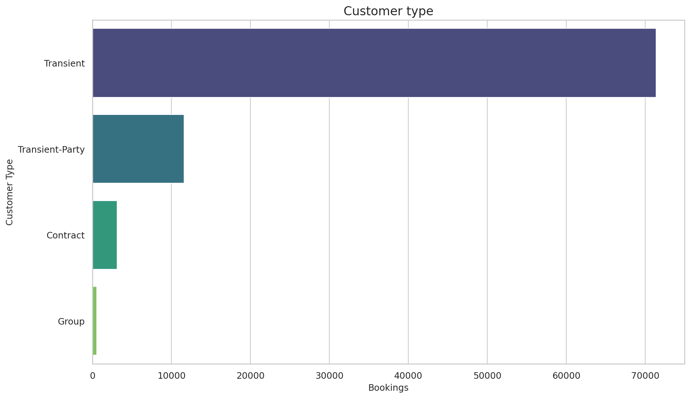

- Business insight: `Transient` is the largest category for customer type.
- Interpretation: Concentration in one or two categories can hide underperforming smaller channels or segments.
- Recommendation: Benchmark ADR and cancellation rate within `customer_type` categories instead of relying only on total booking volume.

### Market segment

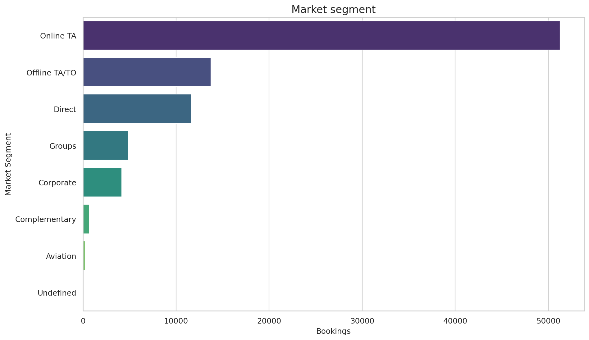

- Business insight: `Online TA` is the largest category for market segment.
- Interpretation: Concentration in one or two categories can hide underperforming smaller channels or segments.
- Recommendation: Benchmark ADR and cancellation rate within `market_segment` categories instead of relying only on total booking volume.

### Distribution channel

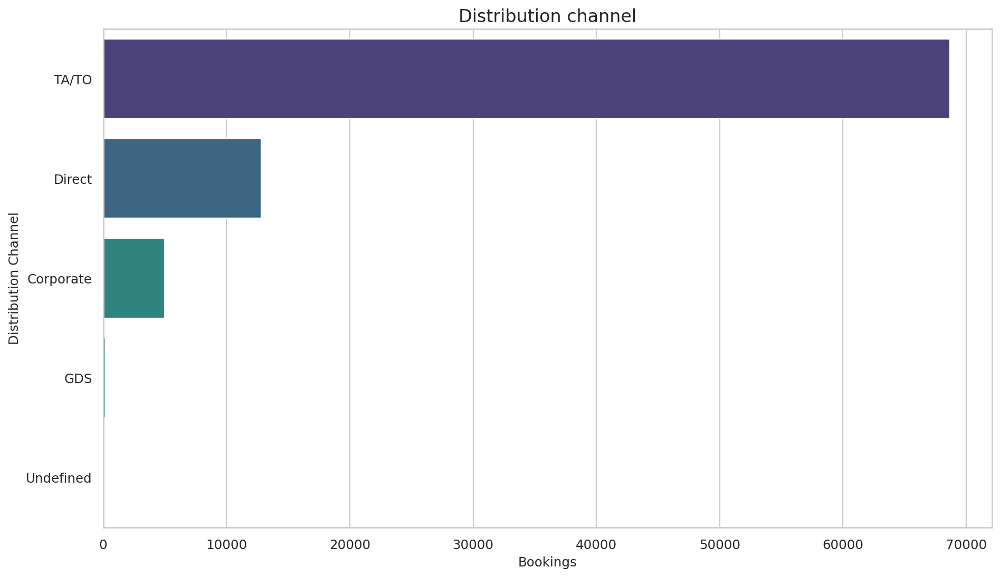

- Business insight: `TA/TO` is the largest category for distribution channel.
- Interpretation: Concentration in one or two categories can hide underperforming smaller channels or segments.
- Recommendation: Benchmark ADR and cancellation rate within `distribution_channel` categories instead of relying only on total booking volume.

### Deposit type

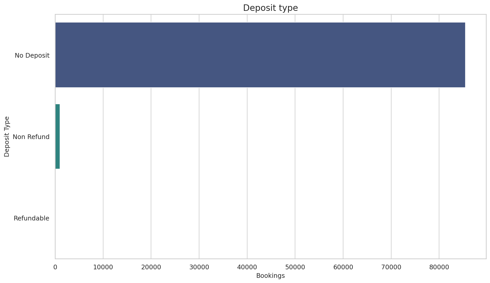

- Business insight: `No Deposit` is the largest category for deposit type.
- Interpretation: Concentration in one or two categories can hide underperforming smaller channels or segments.
- Recommendation: Benchmark ADR and cancellation rate within `deposit_type` categories instead of relying only on total booking volume.

### Lead time

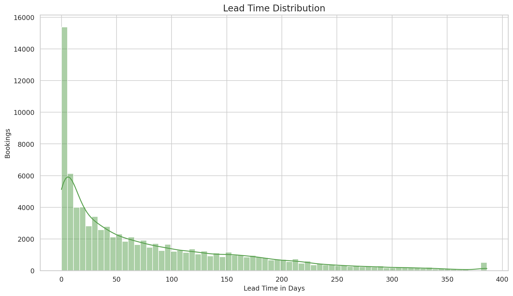

- Business insight: 34.5% of bookings are made more than 90 days before arrival.
- Interpretation: Long booking windows increase exposure to cancellations and rate-shopping behavior.
- Recommendation: Use stricter deposit policies or targeted reminders for long-lead bookings with high cancellation likelihood.

### Monthly booking trends

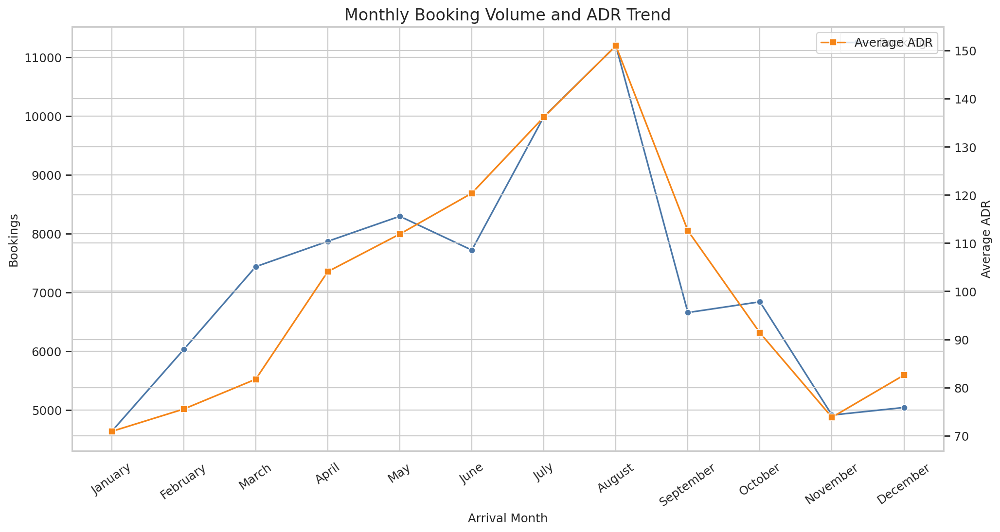

- Business insight: Booking volume peaks in August, while ADR peaks in August.
- Interpretation: Volume and price peaks may not occur in the same month, indicating opportunities for yield management.
- Recommendation: Review months where high demand is not matched by high ADR and test controlled rate increases.

### Seasonal trends

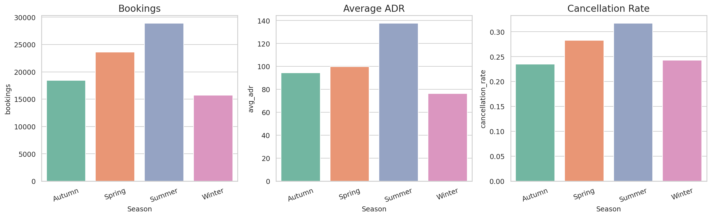

- Business insight: Summer has the highest average ADR.
- Interpretation: Seasonality is a clear input for dynamic pricing because demand, ADR, and cancellation behavior shift together.
- Recommendation: Build seasonal price floors and cancellation-risk adjustments into future rate recommendations.

### Country analysis and top 20 countries

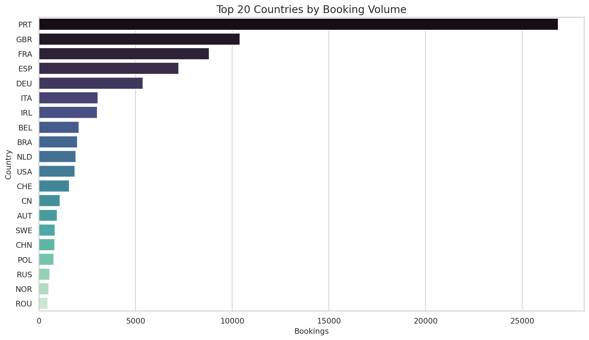

- Business insight: PRT is the largest source market by booking volume.
- Interpretation: Geographic concentration affects cancellation forecasting, campaign language, and rate sensitivity.
- Recommendation: Create country-level dashboards for cancellation rate, ADR, and booking lead time before allocating marketing budget.

### Weekday vs weekend stays

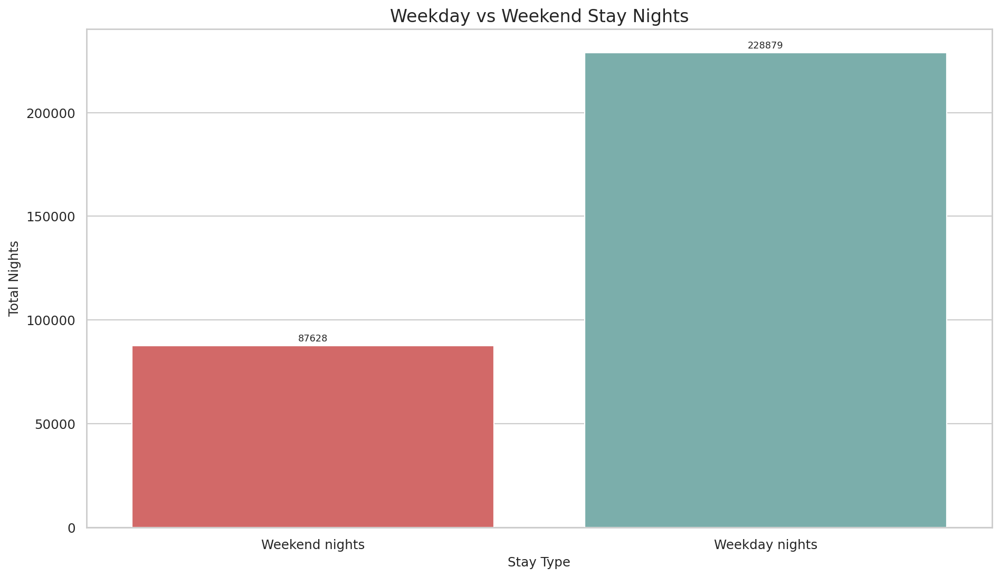

- Business insight: Weekday nights represent the larger share of consumed room nights.
- Interpretation: Demand is not purely weekend leisure-driven; midweek occupancy matters for RevPAR.
- Recommendation: Use weekday-specific pricing and corporate packages to protect midweek occupancy.

### Correlation heatmap

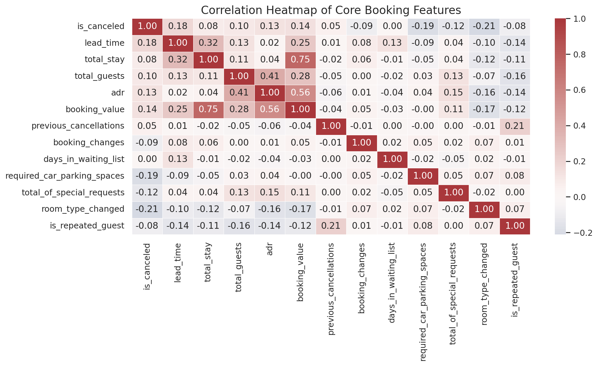

- Business insight: `room_type_changed` has the strongest linear relationship with cancellation among selected numeric features.
- Interpretation: Correlation is not causation, but it helps prioritize variables for churn modeling and dashboard filters.
- Recommendation: Use the strongest cancellation-correlated features as baseline inputs for Week 3 predictive modeling.

### Pairplots where useful

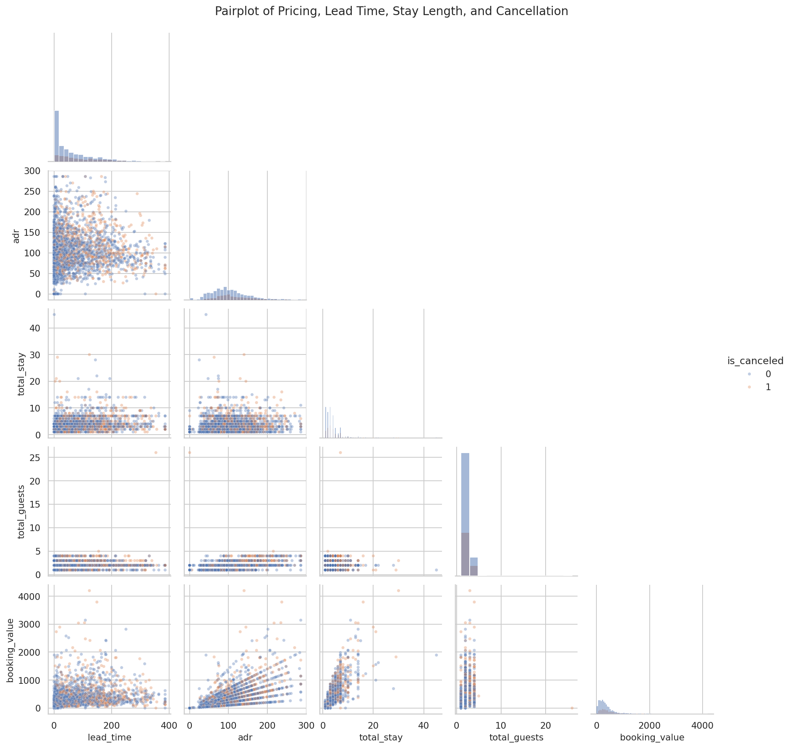

- Business insight: The pairplot shows cancellation separation most visibly across lead time and booking value ranges.
- Interpretation: Feature interactions matter; cancellation risk is unlikely to be explained by a single variable.
- Recommendation: Use multivariate models rather than one-way threshold rules for cancellation prediction.

### Cancellation by hotel type

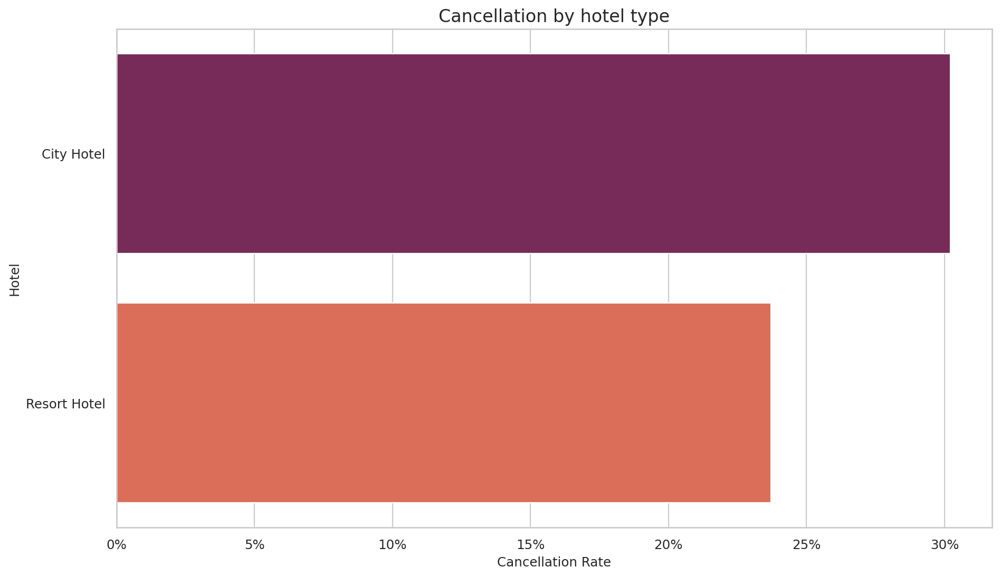

- Business insight: `City Hotel` has the highest cancellation rate among the displayed hotel groups.
- Interpretation: Cancellation risk varies materially by segment, making blanket retention tactics inefficient.
- Recommendation: Prioritize retention offers and deposit-policy review for high-risk `hotel` categories.

### Cancellation by market segment

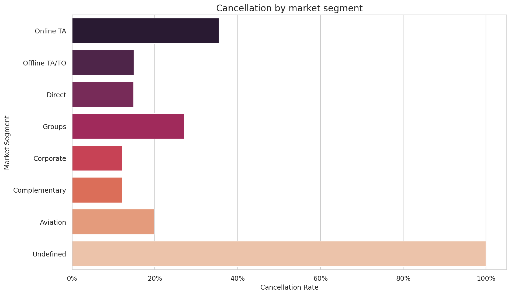

- Business insight: `Undefined` has the highest cancellation rate among the displayed market segment groups.
- Interpretation: Cancellation risk varies materially by segment, making blanket retention tactics inefficient.
- Recommendation: Prioritize retention offers and deposit-policy review for high-risk `market_segment` categories.

### ADR vs cancellation

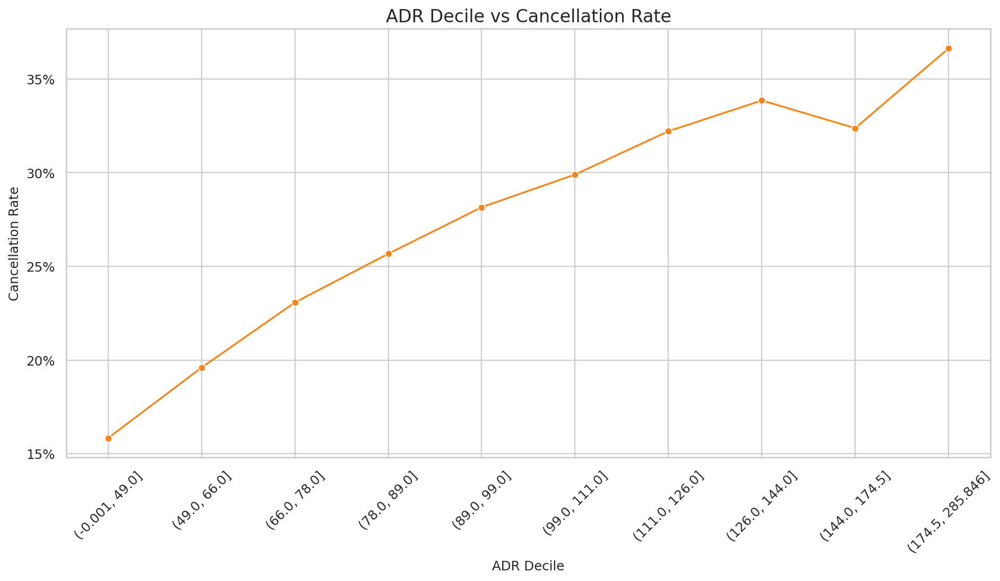

- Business insight: Cancellation rate changes across ADR bands rather than remaining flat.
- Interpretation: Price level is connected to booking confidence, perceived value, and customer flexibility.
- Recommendation: Test cancellation-risk-adjusted pricing and value-add bundles in ADR bands with elevated cancellation.

### Lead time vs cancellation

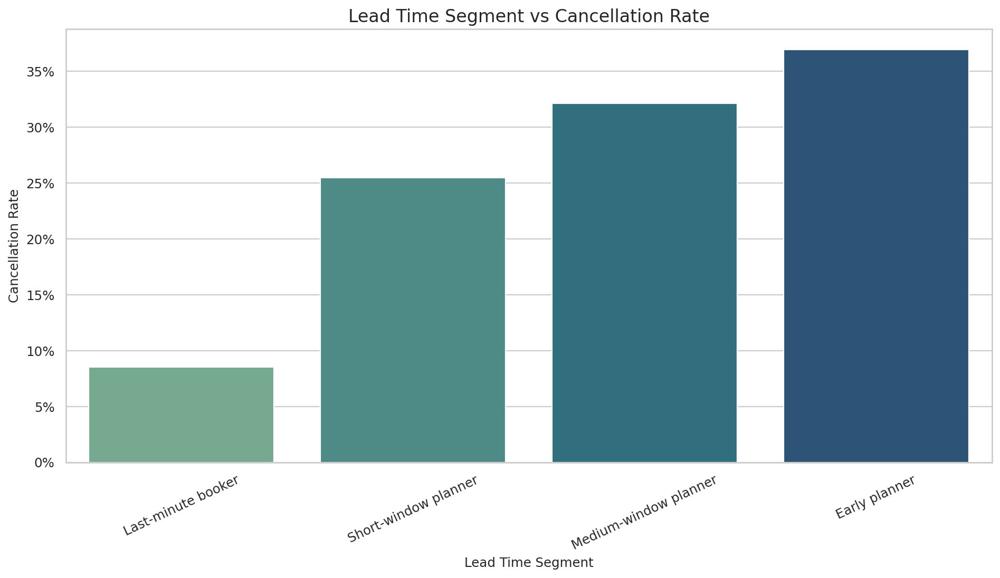

- Business insight: Early planner bookings have the highest cancellation rate.
- Interpretation: Lead time is a practical early warning signal because it is known at booking time.
- Recommendation: Trigger retention communications and stricter inventory controls for high-risk lead-time buckets.

### Length of stay analysis

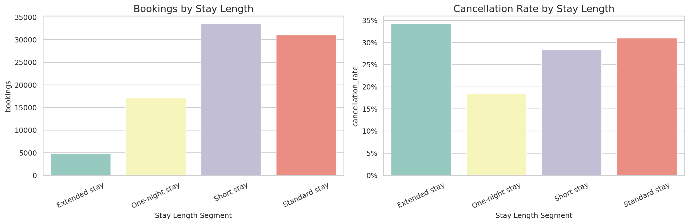

- Business insight: Booking volume and cancellation rate differ by length-of-stay segment.
- Interpretation: Long-stay and short-stay guests should be managed with different cancellation and pricing rules.
- Recommendation: Create length-of-stay controls such as minimum-stay rules in peak periods and targeted discounts in low-demand periods.

## Customer Segmentation

| Segment | Rule | Business Use |
|---|---|---|
| Business travellers | Corporate market segment or corporate distribution channel | Weekday occupancy, negotiated rates, lower-friction booking workflows |
| Leisure travellers | Non-corporate demand, including families and vacation stays | Packages, seasonal promotions, ancillary upsell |
| Early planners | Lead time greater than 90 days | Cancellation-risk monitoring and early-bird rate fences |
| Last-minute bookers | Lead time up to 7 days | Yield capture and distressed inventory sales |
| High-value customers | Booking value at or above the 75th percentile | VIP retention, upgrade offers, and revenue protection |

### Largest Customer Segments

| traveller_segment | lead_time_bucket | customer_value_segment | bookings | cancellation_rate | avg_adr | avg_booking_value | avg_total_stay | avg_lead_time | avg_special_requests |
| --- | --- | --- | --- | --- | --- | --- | --- | --- | --- |
| Leisure traveller | Early planner | Standard value | 16853 | 0.36 | 94.44 | 296.33 | 3.46 | 175.35 | 0.72 |
| Leisure traveller | Medium-window planner | Standard value | 14512 | 0.31 | 97.26 | 277.87 | 3.14 | 56.76 | 0.75 |
| Leisure traveller | Last-minute booker | Standard value | 9863 | 0.08 | 99.93 | 181.86 | 1.95 | 2.12 | 0.65 |
| Leisure traveller | Short-window planner | Standard value | 9836 | 0.25 | 101.86 | 253.95 | 2.74 | 17.96 | 0.80 |
| Leisure traveller | Early planner | High value | 6194 | 0.37 | 120.60 | 634.44 | 5.91 | 175.14 | 0.82 |
| Leisure traveller | Early planner | Premium value | 4905 | 0.41 | 159.89 | 1267.67 | 8.64 | 179.52 | 0.85 |
| Solo short-stay traveller | Last-minute booker | Standard value | 3840 | 0.07 | 76.15 | 109.64 | 1.42 | 2.11 | 0.43 |
| Leisure traveller | Medium-window planner | High value | 3732 | 0.35 | 139.98 | 629.13 | 4.99 | 58.27 | 0.81 |
| Business traveller | Last-minute booker | Standard value | 2861 | 0.08 | 64.99 | 108.29 | 1.67 | 2.73 | 0.31 |
| Leisure traveller | Medium-window planner | Premium value | 2237 | 0.38 | 179.45 | 1221.50 | 7.42 | 59.03 | 0.81 |
| Leisure traveller | Short-window planner | High value | 2108 | 0.29 | 149.07 | 625.89 | 4.67 | 18.68 | 0.89 |
| Solo short-stay traveller | Short-window planner | Standard value | 1896 | 0.21 | 95.29 | 171.09 | 1.81 | 16.63 | 0.56 |

### Highest Cancellation Segments With Meaningful Volume

| traveller_segment | lead_time_bucket | customer_value_segment | bookings | cancellation_rate | avg_adr | avg_booking_value | avg_total_stay | avg_lead_time | avg_special_requests |
| --- | --- | --- | --- | --- | --- | --- | --- | --- | --- |
| Leisure traveller | Early planner | Premium value | 4905 | 0.41 | 159.89 | 1267.67 | 8.64 | 179.52 | 0.85 |
| Leisure traveller | Short-window planner | Premium value | 1112 | 0.40 | 189.21 | 1233.75 | 7.40 | 18.72 | 0.83 |
| Leisure traveller | Medium-window planner | Premium value | 2237 | 0.38 | 179.45 | 1221.50 | 7.42 | 59.03 | 0.81 |
| Leisure traveller | Early planner | High value | 6194 | 0.37 | 120.60 | 634.44 | 5.91 | 175.14 | 0.82 |
| Leisure traveller | Early planner | Standard value | 16853 | 0.36 | 94.44 | 296.33 | 3.46 | 175.35 | 0.72 |
| Leisure traveller | Medium-window planner | High value | 3732 | 0.35 | 139.98 | 629.13 | 4.99 | 58.27 | 0.81 |
| Solo short-stay traveller | Early planner | Standard value | 1429 | 0.35 | 81.54 | 182.80 | 2.23 | 191.55 | 0.36 |
| Solo short-stay traveller | Medium-window planner | Standard value | 1506 | 0.32 | 86.91 | 177.85 | 2.07 | 53.23 | 0.46 |
| Leisure traveller | Medium-window planner | Standard value | 14512 | 0.31 | 97.26 | 277.87 | 3.14 | 56.76 | 0.75 |
| Leisure traveller | Short-window planner | High value | 2108 | 0.29 | 149.07 | 625.89 | 4.67 | 18.68 | 0.89 |

