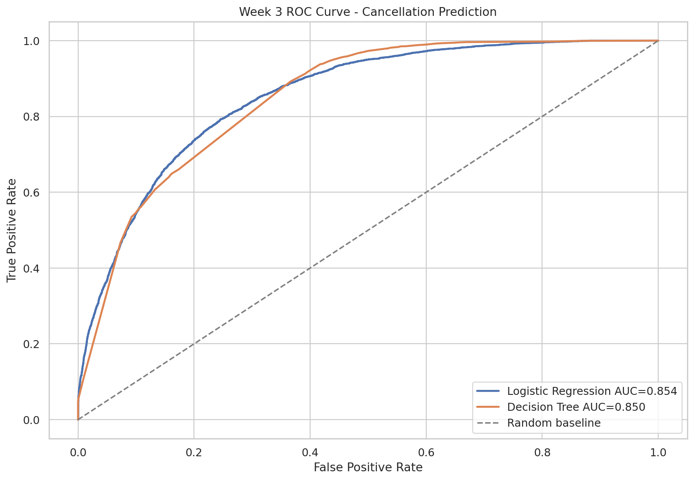
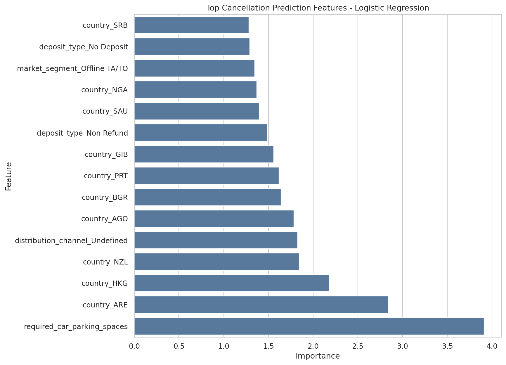

# Week 3 Predictive Modeling Report

## Objective

Build baseline machine learning models to predict whether a booking will be canceled. This supports customer retention campaigns, cancellation-risk scoring, and cancellation-adjusted revenue forecasting.

## Data Setup

- Target variable: `is_canceled`
- Training rows: 69,310
- Testing rows: 17,328
- Overall cancellation rate: 27.69%
- Split method: stratified 80/20 train-test split
- Models trained: Logistic Regression and Decision Tree

## Leakage Controls

The model excludes `reservation_status`, `reservation_status_date`, `assigned_room_type`, and `room_type_changed` because they can represent post-booking or outcome-adjacent information. The retained features are known or reasonably available at booking time.

## Model Performance

| model | accuracy | precision | recall | roc_auc |
| --- | --- | --- | --- | --- |
| Logistic Regression | 0.765 | 0.553 | 0.788 | 0.854 |
| Decision Tree | 0.705 | 0.482 | 0.894 | 0.850 |

Best baseline model by ROC-AUC: **Logistic Regression**



## Confusion Matrices

- `visualizations/23_week3_confusion_matrix_logistic_regression.png`
- `visualizations/23_week3_confusion_matrix_decision_tree.png`

## Top Predictive Features



| feature | importance | signed_effect |
| --- | --- | --- |
| required_car_parking_spaces | 3.909 | -3.909 |
| country_ARE | 2.844 | 2.844 |
| country_HKG | 2.183 | 2.183 |
| country_NZL | 1.844 | -1.844 |
| distribution_channel_Undefined | 1.828 | 1.828 |
| country_AGO | 1.783 | 1.783 |
| country_BGR | 1.640 | -1.640 |
| country_PRT | 1.619 | 1.619 |
| country_GIB | 1.560 | 1.560 |
| deposit_type_Non Refund | 1.486 | 1.486 |
| country_SAU | 1.396 | 1.396 |
| country_NGA | 1.369 | 1.369 |
| market_segment_Offline TA/TO | 1.348 | -1.348 |
| deposit_type_No Deposit | 1.291 | -1.291 |
| country_SRB | 1.283 | -1.283 |

### Logistic Regression Classification Report

```text
              precision    recall  f1-score   support

Not canceled       0.90      0.76      0.82     12531
    Canceled       0.55      0.79      0.65      4797

    accuracy                           0.77     17328
   macro avg       0.73      0.77      0.74     17328
weighted avg       0.81      0.77      0.78     17328

```

### Decision Tree Classification Report

```text
              precision    recall  f1-score   support

Not canceled       0.94      0.63      0.76     12531
    Canceled       0.48      0.89      0.63      4797

    accuracy                           0.70     17328
   macro avg       0.71      0.76      0.69     17328
weighted avg       0.81      0.70      0.72     17328

```

## Business Interpretation

- High recall helps identify more bookings likely to cancel, which is useful for retention campaigns.
- Precision shows how many flagged bookings are truly cancellations, which matters for avoiding unnecessary discounts.
- ROC-AUC is the best comparison metric here because it evaluates ranking quality across thresholds.
- The baseline model is suitable for decision support, not yet for automated production pricing.

## Recommendations for Week 4 and Future Work

- Use predicted cancellation probability in expected revenue: `expected_revenue = booking_value * (1 - cancellation_probability)`.
- Create risk bands such as low, medium, and high cancellation probability.
- Target high-risk, high-value bookings with retention offers before arrival.
- Tune classification thresholds by business cost, not only by default model cutoff.
- Add cross-validation and hyperparameter tuning before production deployment.
